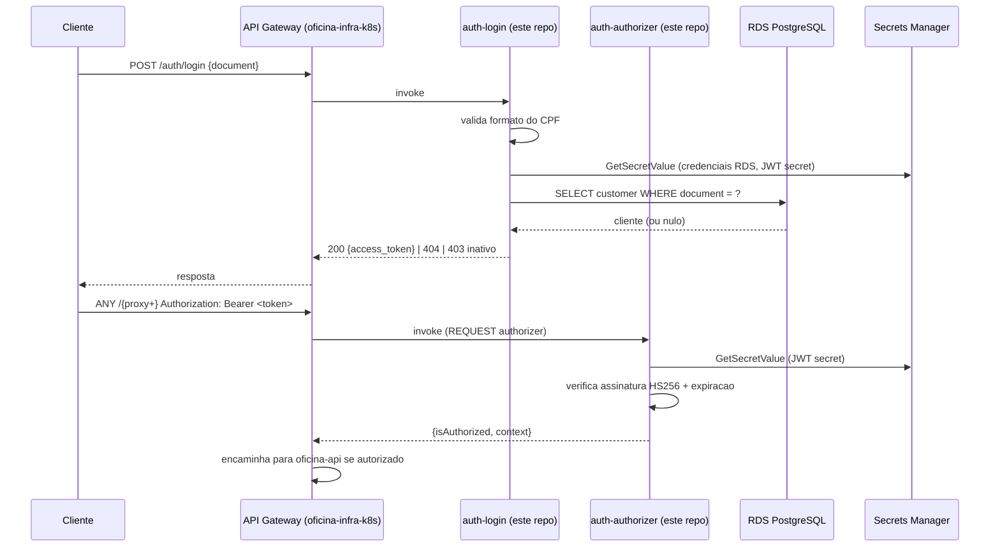

# oficina-lambda-auth

Function Serverless de autenticação por CPF do Tech Challenge Fase 3 (POSTECH). Parte do split de repositórios descrito em [ADR-0005](https://github.com/Williamnasci/oficina-api/blob/main/docs/adr/0005-split-de-repositorios.md), no repositório principal [`oficina-api`](https://github.com/Williamnasci/oficina-api).

## Propósito

Duas funções Lambda, acionadas pelo API Gateway do repositório [`oficina-infra-k8s`](https://github.com/Williamnasci/oficina-infra-k8s):

- **auth-login**: valida o formato do CPF, consulta a existência/status do cliente no banco (RDS PostgreSQL, mesma base do `oficina-api`) e emite um JWT.
- **auth-authorizer**: Lambda Authorizer (tipo `REQUEST`) que verifica a assinatura do JWT nas rotas protegidas do API Gateway.

Decisão e alternativas consideradas (por que Lambda própria em vez de Amazon Cognito) documentadas em [RFC-0003](https://github.com/Williamnasci/oficina-api/blob/main/docs/rfc/0003-estrategia-de-autenticacao.md).

## Tecnologias

- Node.js 20 / TypeScript
- AWS Lambda + API Gateway (HTTP API v2)
- `pg` (node-postgres) — consulta direta a `Customer`, sem Prisma (repositório independente, sem acesso ao schema do `oficina-api`)
- `jsonwebtoken` (assinatura/verificação HS256)
- `@aws-sdk/client-secrets-manager` (segredo de assinatura e credenciais do RDS, resolvidos e cacheados em runtime)
- `esbuild` (empacotamento em bundle único por função)
- Jest (16 testes unitários — CPF, `auth-login`, `auth-authorizer`)
- Terraform (deploy da função — coordenado com `oficina-infra-k8s` para o registro das rotas)
- GitHub Actions (CI/CD)

## Status

✅ Completo e validado ponta a ponta contra a infraestrutura real: as duas funções Lambda aplicadas via Terraform (IAM por função, timeouts explícitos, CA da RDS embutida), CI/CD verde (`build → typecheck → test → terraform plan` na PR, `apply` manual — ver nota abaixo), e as rotas registradas no API Gateway (`oficina-infra-k8s`). Testado com um cliente real: login por CPF emite um JWT que o `auth-authorizer` valida corretamente no formato de resposta simples (`enable_simple_responses`).

## Deploy e execução

```bash
npm install
npm test        # 16 testes unitários
npm run typecheck
npm run build    # gera dist/auth-login/index.js e dist/auth-authorizer/index.js
```

Deploy real via Terraform (`terraform/`) + CI/CD (`.github/workflows/ci-cd.yml`): `terraform plan` em toda PR/push. O job `terraform-apply` **não roda mais automático no merge** — só via disparo manual (`gh workflow run ci-cd.yml` ou pela aba Actions), porque a conta AWS Academy Learner Lab usada neste projeto só fornece credenciais de sessão temporárias (`iam:CreateUser` é negado pelo `LabRole`, então não há como manter uma credencial IAM permanente segura como secret). Antes de disparar o apply manualmente, atualize os secrets `AWS_ACCESS_KEY_ID` / `AWS_SECRET_ACCESS_KEY` / `AWS_SESSION_TOKEN` com uma sessão fresca do lab (AWS Details → Show).

## Contrato da API

Exposta via API Gateway (`oficina-infra-k8s`), não tem Swagger (não é um framework REST com OpenAPI) — o contrato é este:

**`POST /auth/login`** (público)
```json
// Request
{ "document": "11144477735" }

// Response 200
{ "access_token": "eyJhbGciOiJIUzI1NiIs..." }

// Response 404 — cliente não encontrado
{ "message": "Customer not found." }
```

**Lambda Authorizer** (`auth-authorizer`) — invocada automaticamente pelo API Gateway nas rotas protegidas (`ANY /{proxy+}`), a partir do header `Authorization: Bearer <token>`. Não é chamada diretamente por clientes.

## Diagrama

Visão focal deste repositório (fluxo de auth — o diagrama completo da solução está no [Diagrama de Componentes](https://github.com/Williamnasci/oficina-api/blob/main/docs/architecture-components.md) do `oficina-api`):


